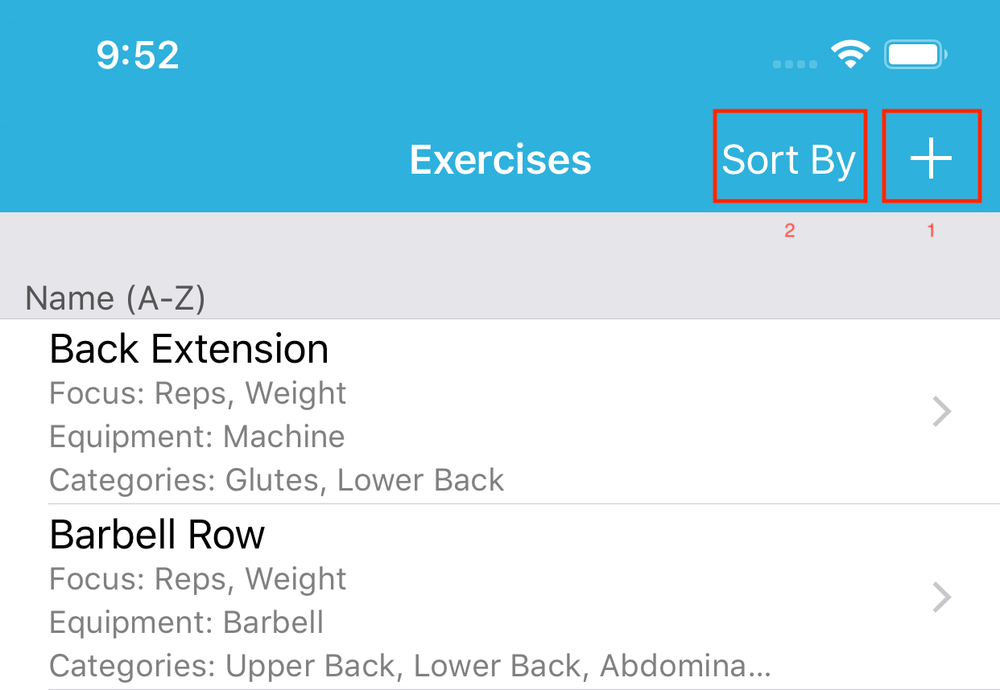
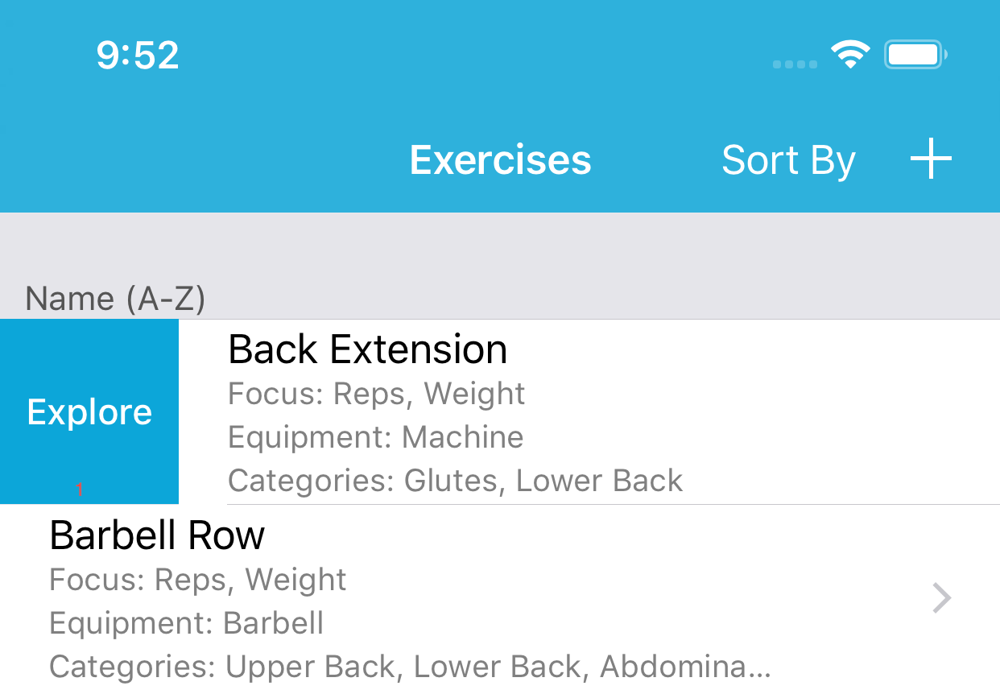
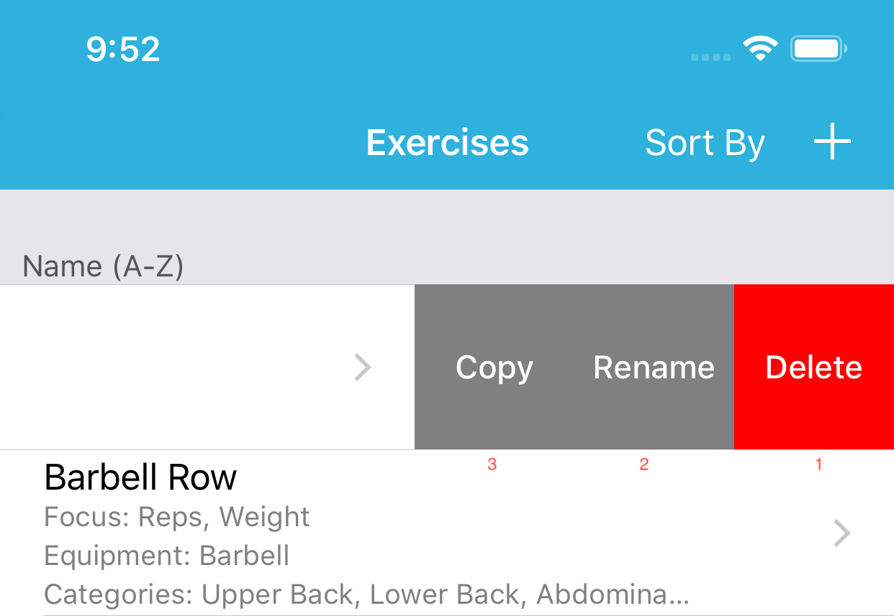

# Exercises

Here you will find all your exercises and compose new ones.  

FitNotes comes preloaded with a few dozen exercises to get your started but adding new ones is simple and easy.

1. Will start the process of creating a new exercise.

2. Shows a screen to determine the exercise display order.

!!! note
    Pull down to reveal a search bar
    
Swipe Right             |  Swipe Left
:-------------------------:|:-------------------------:
   |  

Swipe Right:  
1\. **Explore**  
Shows analytics about this Exercise.

Swipe Left:  
1\. **Delete**  
Deletes this Exercise definition.  

!!! note
    All your completed exercises will not be affected.  

2\. **Rename**  
Allows you to rename this Workout definition.  

3\. **Copy**  
Creates a copy of this Exercise definition