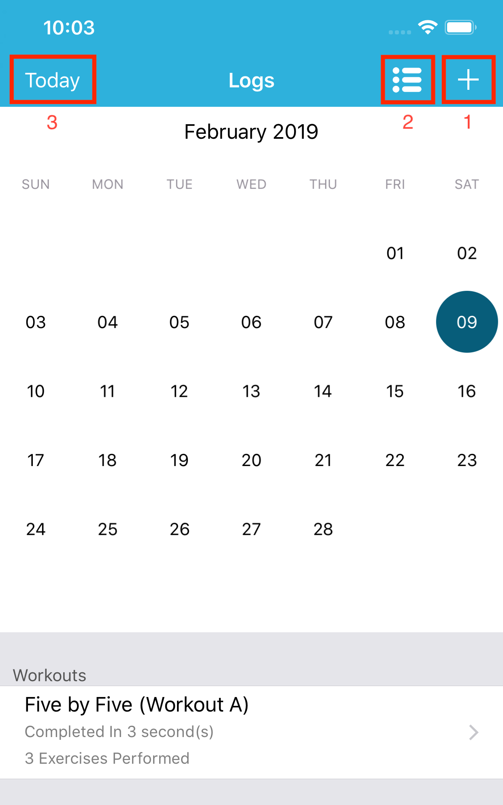
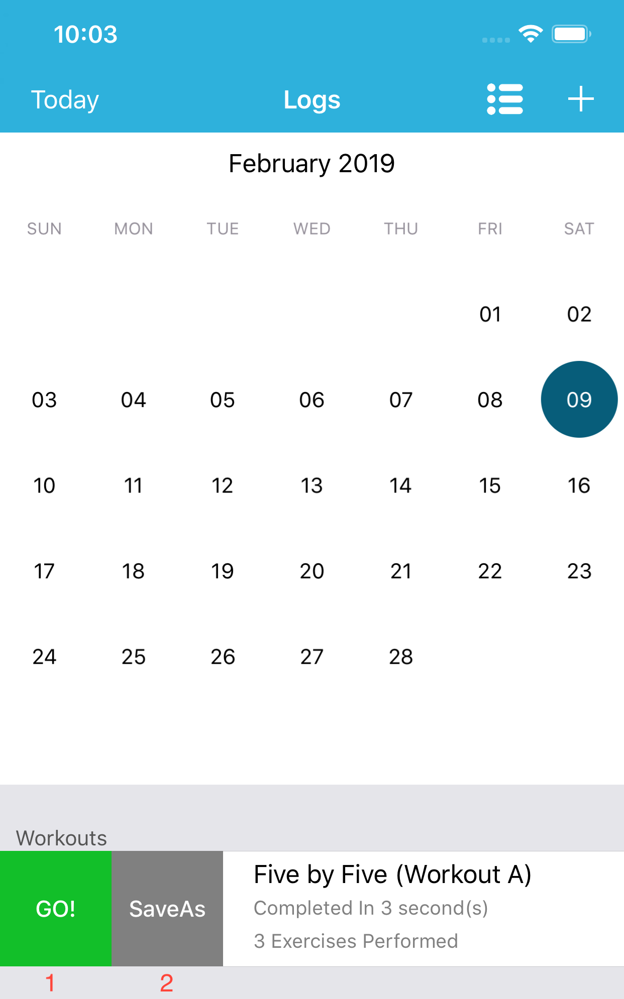
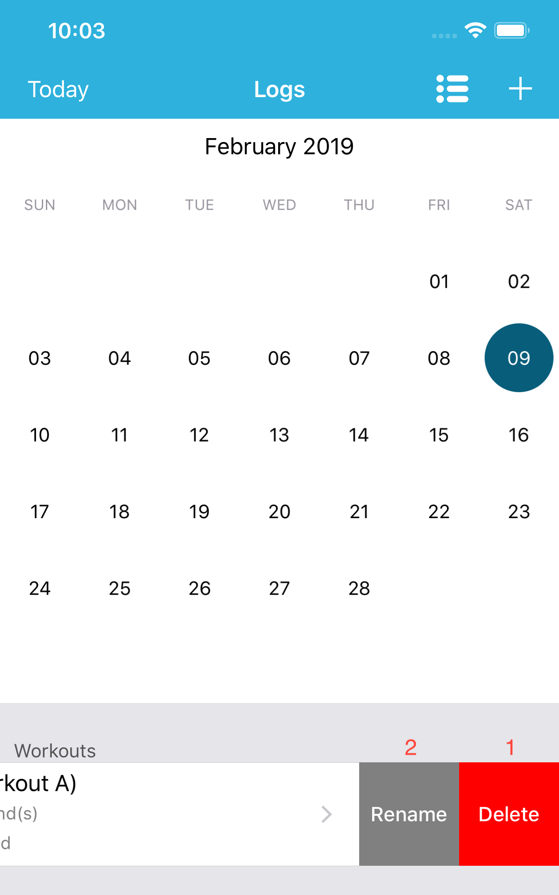

# Logs

Here you will find all your completed Workouts and allow you to add historical ones.

1. Will start the process of adding a historical workout.

2. Will display your workout logs in a list format

3. Will center the calendar on todays date.
    
Swipe Right             |  Swipe Left
:-------------------------:|:-------------------------:
   |  

Swipe Right:  
1\. **GO!**  
Will start this workout with the exact same values.

2\. **SaveAs**  
Will allow you to add this workout to a workout definition as WOD or save it as a brand new Workout definition.

Swipe Left:  
1\. **Delete**  
Deletes this workout. 

2\. **Rename**  
Allows you to rename this Workout.  