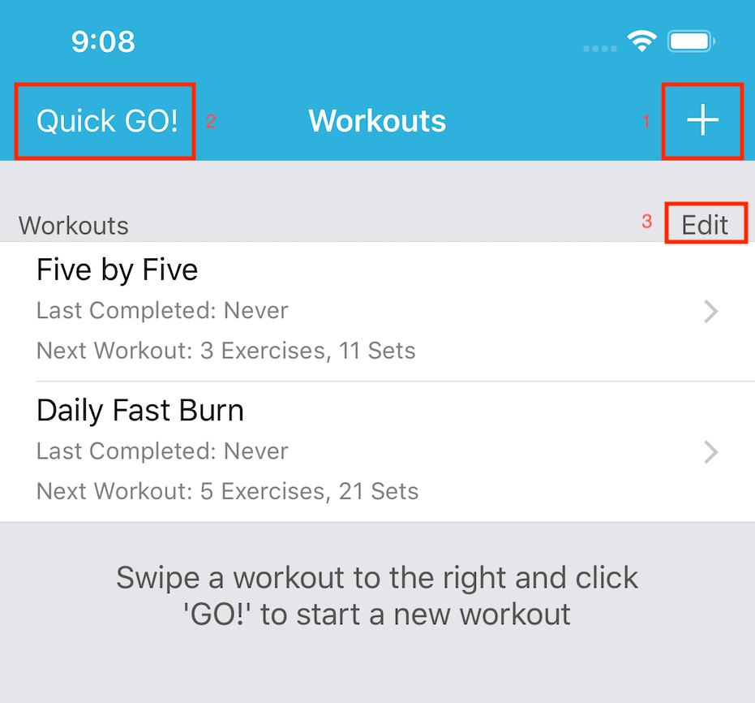
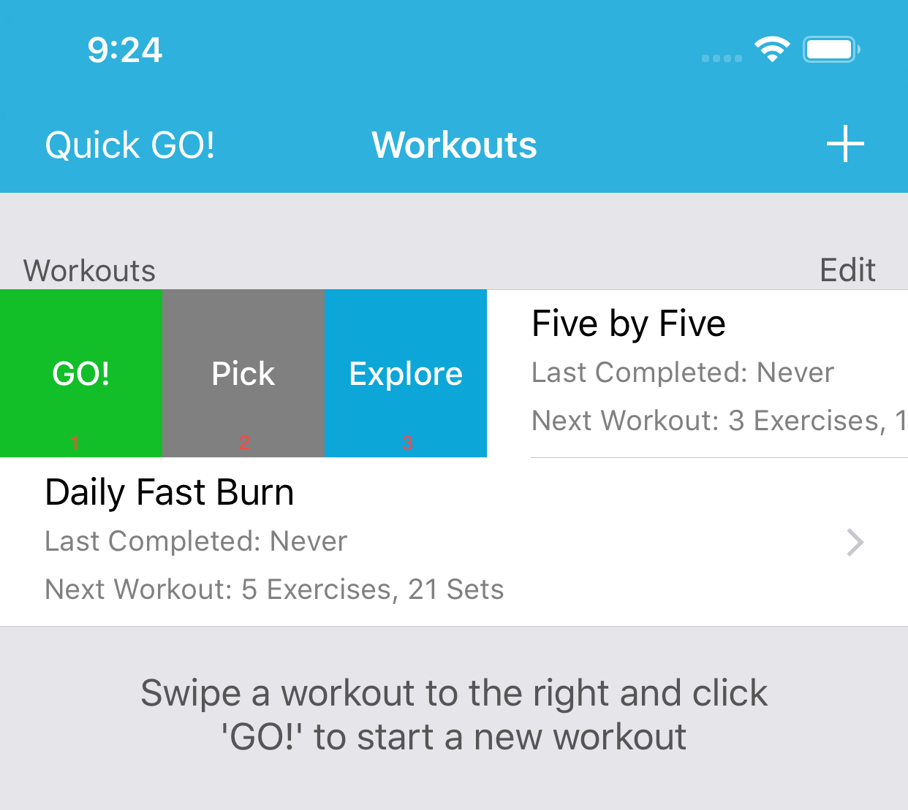
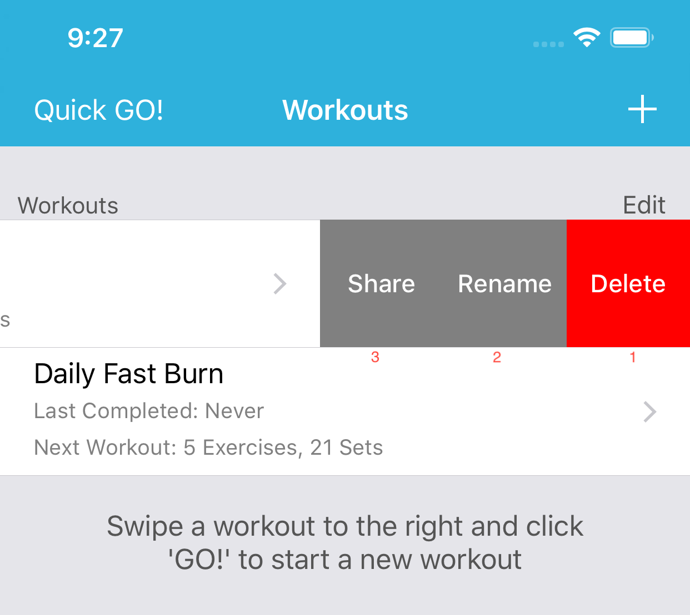

# Workouts

Here you will find all your workouts and compose new ones.  

FitNotes comes preloaded with two workouts to get your started but adding new ones is simple and easy.

1. Will start the process of creating a new workout.

2. Will start a new workout without any exercises.

3. Will allow reordering the workouts.

Swipe Right             |  Swipe Left
:-------------------------:|:-------------------------:
   |  

Swipe Right:  
1\. **GO!**  
Will immediately start this workout.

2\.  **Pick**  
Shows a list of all **WOD**, upon selection the workout will start immediately.  

!!! note
    This option only shows up for Workouts with more than one **WOD**

3\. **Explore**  
Shows analytics about this workouts.

Swipe Left:  
1\. **Delete**  
Deletes this workout definition.  

!!! note
    All your completed workouts will not be affected.  

2\. **Rename**  
Allows you to rename this Workout definition.  

3\. **Share**  
Displays a screen which will allow you to share this workout.